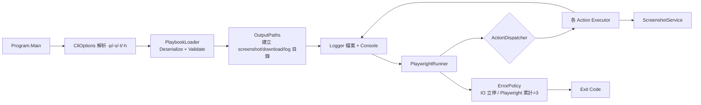

# `playwrightbook` 開發計畫

依據 [spec.md](spec.md) 並對照現有 [Program.cs](../src/playwrightbook/Program.cs)、[PlaywrightTest.cs](../src/playwrightbook/PlaywrightTest.cs)、[Template.cs](../src/playwrightbook/Model/Template.cs)、[PlaybookTemplate.json](../src/playwrightbook/PlaybookTemplate.json) 的落差，規劃以下迭代。

## 一、現況落差摘要

| 項目 | 現況 | 規格要求 |
|------|------|---------|
| CLI 參數 | 僅取 `args[0]` 當 playbook | 支援 `-p / -s / -t / -h`，找不到 playbook 印說明後 exit 10 |
| Model | 僅 `action / url / value / selector` | 新增 `step / delay / timeout`，`args` 可為 null |
| Action | 僅 `click / delay / fill / goto` 4 種 | 17 種 action 全覆蓋 |
| Logger | `Console.WriteLine` 雜訊 | 結構化 `timestamp \| step \| action \| level \| message`，error 紅字，同步寫檔 |
| 截圖 | 無 | 一般截圖 + error 截圖、`yyyyMMddHHmmssfff` 命名、重名加序號 |
| 錯誤處理 | 吞例外繼續 | System.IO 立即停（exit 30）、Playwright 累計 >3 停（exit 40） |
| Exit Code | 一律 0 | 0 / 10 / 20 / 30 / 40 |
| 瀏覽器收尾 | 只關 page | 程式結束前確實關閉 browser/playwright |
| 時間/路徑 | 無 | 台北時間（UTC+8），output 根目錄 `output/{yyyyMMddHHmm}/` |

## 二、模組切分

建議檔案結構：

- [Program.cs](../src/playwrightbook/Program.cs)：流程入口、Exit Code 收斂
- `Cli/CliOptions.cs`：參數解析、`-h` 說明字串
- `Model/PlaybookModels.cs`（取代 [Template.cs](../src/playwrightbook/Model/Template.cs)）：`Playbook`、`PlaybookArgs`
- `Runtime/OutputPaths.cs`：集中管理 `output/{yyyyMMddHHmm}` 子路徑與檔名生成
- `Runtime/Logger.cs`：Log 格式化與檔案/Console 雙寫
- `Runtime/ScreenshotService.cs`：截圖命名規則 + 重複序號
- `Runtime/ErrorPolicy.cs`：錯誤分類與 Playwright 計數
- `Runtime/PlaywrightRunner.cs`：browser/context/page 生命週期
- `Actions/IActionExecutor.cs`、`Actions/ActionDispatcher.cs`
- `Actions/*.cs`：每個 action 一檔（共 17 個）

## 三、開發里程碑

### M1 — CLI 與基礎建設（exit 0 / 10）

1. `CliOptions` 解析 `-p / -s / -t / -h`；未知參數或缺值 → 印說明後 exit **10**。
2. `-h` 印出參數說明（含 Exit Code 表）後 exit 0。
3. Playbook 路徑解析：先當絕對路徑、再相對 `Environment.CurrentDirectory`；未指定 `-p` 時找 `Environment.CurrentDirectory/PlaybookTemplate.json`；最終仍找不到 → 印說明後 exit **10**。
4. `OutputPaths`：以 `Main` 啟動時的台北時間（`TimeZoneInfo.FindSystemTimeZoneById("Taipei Standard Time")`）固定 `yyyyMMddHHmm`，建立 `screenshot/`、`download/` 與 log 檔。
5. `Logger`：格式 `yyyy-MM-dd HH:mm:ss.fff | step | action | level | message`；`error` 走 `Console.Error` 並以 `ConsoleColor.Red` 顯示；同步 append 到 log 檔。

### M2 — Playbook 載入與驗證（exit 20）

1. 重寫 `PlaybookModels`：
   - `Playbook { string? step; string action; PlaybookArgs? args; }`
   - `PlaybookArgs { string? selector; string? value; string? url; int? delay; int? timeout; }`
2. `PlaybookLoader`：
   - `JsonSerializer.Deserialize` 失敗（含格式錯誤、欄位型別錯誤）→ exit **20**。
   - 反序列化後遍歷驗證：
     - `action` 必須是 17 個合法名稱之一（不分大小寫，建議統一轉小寫比對），否則 exit 20。
     - 各 action 的必填 args 缺失即 exit 20，例如：
       - `goto` 缺 `url`
       - `click / doubleclick / hover / focus / scrollto / check / fill / select / type / press / elementexists / download / uploadfile` 缺 `selector`
       - `fill / select / type / uploadfile / press` 缺 `value`（`press / type` 允許空字串/null，但 key 必須存在 → 改以「value 不存在」視為錯誤）
       - `delay` 缺 `delay`
3. 驗證錯誤訊息含「playbook 第 n 個項目 / step」便於定位。

### M3 — Runner 與基本 Action（goto / click / fill / delay / screenshot）

1. `PlaywrightRunner`：依規格啟動 Edge（`Channel=msedge`, `Headless=false`, `SlowMo=25`），以 `await using` + `try/finally` 確保 browser/playwright 釋放。
2. 將 `goto / click / fill / delay / screenshot` 改寫為 `IActionExecutor`：
   - 每個 executor 從 `PlaybookArgs` 取值，缺省 `timeout = 30000`。
   - 成功寫一筆 info log（message 描述成功內容）。
3. `ScreenshotService`：
   - 一般 `{timestamp}_{action}.png`、錯誤 `{timestamp}_{action}_error.png`，timestamp 為 `yyyyMMddHHmmssfff`（台北時間）。
   - 同名重複時加 `_1` 起跳序號（不補零）。

### M4 — 錯誤策略（exit 30 / 40）

1. `ErrorPolicy`：
   - `IOException`（含 `DirectoryNotFoundException`、`FileNotFoundException` 等 `System.IO` 衍生例外）→ 寫 error log + error screenshot → 立即 exit **30**。
   - `PlaywrightException` / `TimeoutException` → 寫 error log + error screenshot → `playwrightErrorCount++`；`>3` → exit **40**，否則繼續下一個 action。
   - 其他未預期例外：視為 Playwright 類別累計（保守策略，避免未分類例外導致流程停擺；可於後續調整）。
2. `ActionDispatcher` 在每個 action 外層包 `try/catch`，將上述策略集中處理。
3. 截圖本身失敗時不再丟出（避免錯誤連鎖），以 fallback log 紀錄。

### M5 — 其餘 Action 補齊

依 [Action 定義](spec.md#action-定義) 實作其餘 12 個：

- 流程類：`goback`、`hover`、`focus`、`scrollto`
- 輸入類：
  - `press`：`value` 為空字串/null 時略過、不 log error；其餘呼叫 `Locator.PressAsync`，套用 `delay / timeout`。
  - `type`：同上規則，呼叫 `Locator.TypeAsync`。
- 互動類：
  - `check`：`Locator.CheckAsync`
  - `doubleclick`：`Locator.DblClickAsync`，套用 `delay / timeout`
  - `select`：`value` 以 `,` 分隔轉陣列後呼叫 `Locator.SelectOptionAsync`
  - `elementexists`：`value` 解析為 `WaitForSelectorState.Attached/Visible`（不分大小寫），預設 Visible
- 檔案類：
  - `download`：依規格用 `WaitForDownloadAsync` + `ClickAsync` + `SaveAsAsync`，存到 `output/{yyyyMMddHHmm}/download/{下載檔名}`，重名加 `_1` 起跳序號（保留副檔名），完整路徑寫 log。
  - `uploadfile`：`value` 為絕對路徑直接用，否則相對 `Environment.CurrentDirectory`；呼叫 `Locator.SetInputFilesAsync`。

統一規則：
- `timeout` 預設 30000。
- 成功一筆 info log，失敗一筆 error log + error screenshot。
- log 的 `step` 欄位取 `Playbook.step`，無則留空字串。

### M6 — 收尾與煙霧測試

1. `Main` 以 `try/finally` 確保關閉 browser、flush log；以單一 `int exitCode` 收斂回傳值。
2. 同步更新 [PlaybookTemplate.json](../src/playwrightbook/PlaybookTemplate.json)：
   - 移除/替換不在規格內的 `havetext`（改為 `elementexists` + `value: "Visible"` 較貼近原意）。
   - `delay` 步驟的參數改用 `args.delay`（spec 定義為 number），而非現行的 `args.value` 字串。
3. 用更新後的 template 跑一次端到端煙霧測試：驗證 log 檔、screenshot、download 目錄產生正確。
4. 撰寫簡短 README 補充 build/run 指令（例如 `dotnet run -- -p ./PlaybookTemplate.json`）。

## 四、驗收檢核清單

- [ ] `-h` 顯示完整說明後 exit 0
- [ ] 缺檔/無效 `-p` 印說明後 exit 10
- [ ] JSON 損毀或未知 action 或缺必填 args → exit 20
- [ ] 任一 `IOException` → 立刻 exit 30，且有 error log/screenshot
- [ ] 第 4 次 Playwright 錯誤 → exit 40
- [ ] log 檔與 console 格式一致；error 為紅字
- [ ] 截圖 / 下載檔重名自動加 `_1` 起跳序號
- [ ] 程式結束時 browser 已關閉（無殘留 Edge process）
- [ ] 17 個 action 各有正例與錯誤情境覆蓋

## 五、後續可選優化（不在本次範圍）

- 以 `System.CommandLine` 或 `Spectre.Console.Cli` 取代手刻 CLI 解析。
- 將 log 改為 `Microsoft.Extensions.Logging` + 自訂 formatter。
- 增加 dry-run / verbose 旗標、Playwright trace 收集。
- 單元測試（PlaybookLoader 驗證、ScreenshotService 命名）與整合測試。
